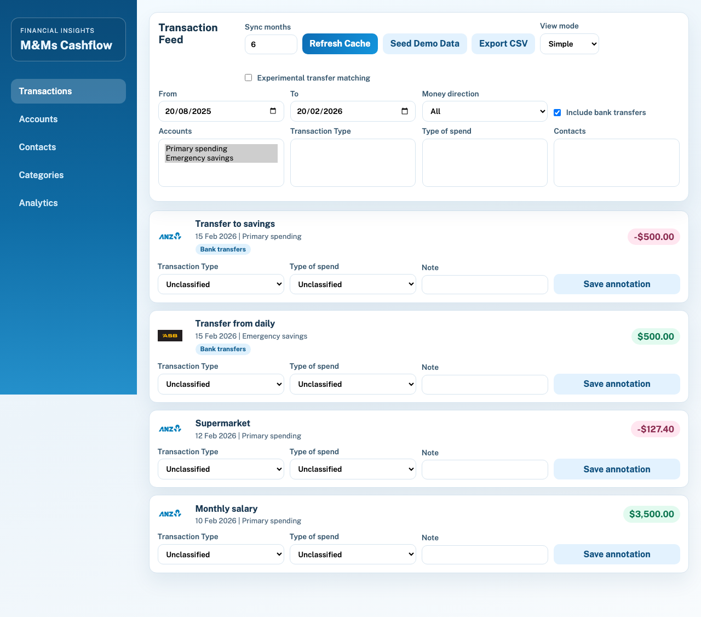
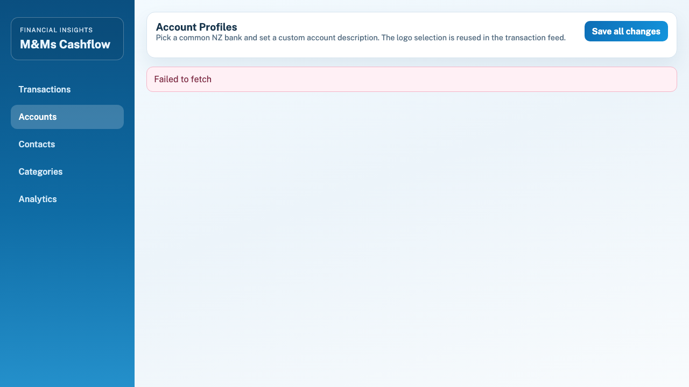
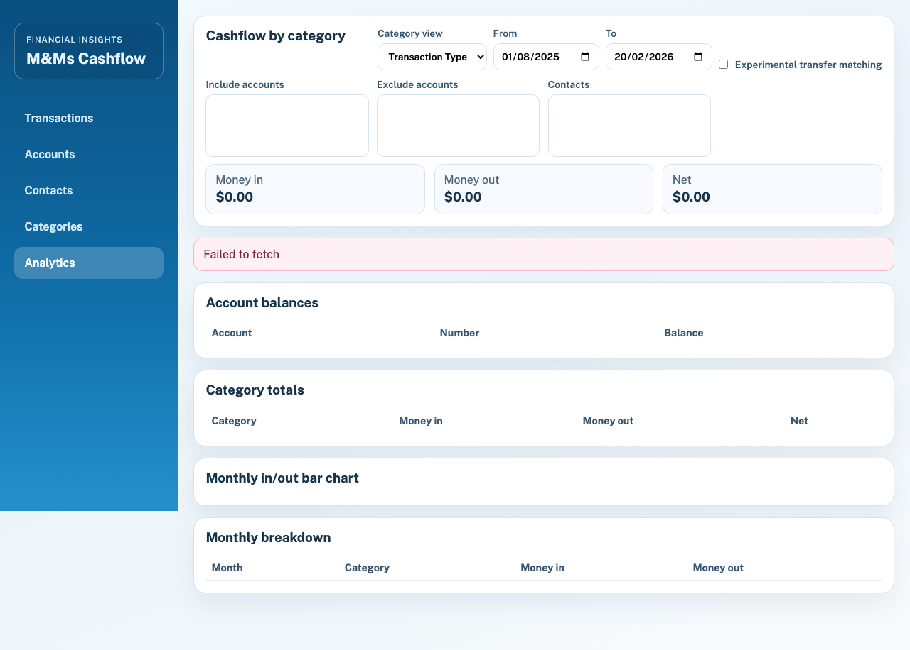
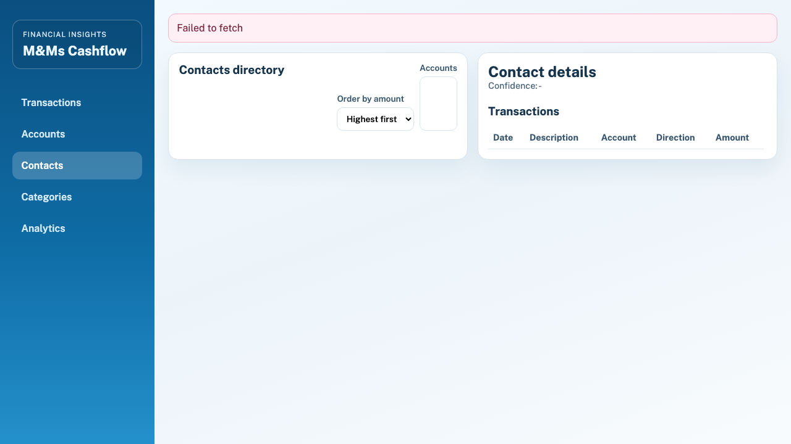
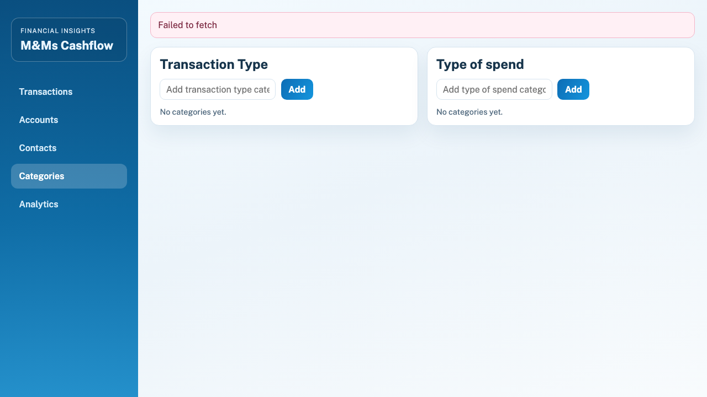

# M&Ms Cashflow

M&Ms Cashflow is a local-first personal finance web app for New Zealand banking data via Akahu.  
It caches transactions into a local PostgreSQL database, supports rich filtering/annotation, and provides analytics that can be explored without continuously calling Akahu.

## Product spec

### Core goals
- Sync and cache transaction data from Akahu into a local relational database.
- Support analysis workflows across accounts in a single feed.
- Label and filter transfers, categories, spend types, and contacts.
- Persist all local metadata (annotations, categories, account profiles) across app restarts.

### Key capabilities
- Akahu account + transaction sync with configurable time windows.
- Transaction feed with:
  - account, date, direction, transfer, category, spend-type, and contact filters
  - transaction annotations (category + spend type + notes)
  - simple and advanced view modes
- Advanced transaction mode with independent columns:
  - Money In
  - Money Out
  - Bank Transfers
- Experimental read-time transfer matching:
  - same absolute amount
  - opposite signs
  - different accounts
  - within 4 days
- Contacts directory with monthly cashflow drill-in.
- Analytics with category totals, monthly overviews, and account balances.
- CSV export for all transactions in DB.
- GDPR helper endpoints for export/purge.

### Non-functional coverage
- Structured backend logging and global exception handling.
- Local DB persistence (PostgreSQL).
- Unit, integration, UI, and e2e test suites.
- Basic privacy controls and metadata backup/restore scripts.

## Screenshots

These screenshots were generated from isolated demo seed data only (no personal data).







## Tech stack

- Backend: ASP.NET Core 8 (C#), EF Core, PostgreSQL
- Frontend: React + TypeScript + Vite
- DB runtime: Docker Compose (`postgres:16-alpine`)
- Testing:
  - Backend unit + integration tests (xUnit)
  - Frontend UI tests (Vitest + Testing Library)
  - E2E tests (Playwright)

## Akahu setup

### 1. Create an Akahu app and obtain an app token
- Create/login to your Akahu developer account.
- Create an app in the Akahu developer portal.
- Copy your app token from the app dashboard.

Reference:
- [Akahu Developer Portal](https://my.akahu.io/)
- [Akahu API docs](https://developers.akahu.io/)

### 2. Obtain a user token
- Follow Akahu's auth flow to connect your own bank accounts and receive a user token.
- For local personal use, use the connected user token from your own Akahu app flow.

Reference:
- [Auth overview](https://developers.akahu.io/docs/endpoints/auth/token)
- [Accounts endpoint](https://developers.akahu.io/docs/endpoints/accounts/get)

### 3. Configure local secrets (do not commit)
Create or update:
- `/Users/mohitbaweja/Documents/FinancialInsightsApp/backend/FinancialInsights.Api/appsettings.Local.json`

Example:

```json
{
  "ConnectionStrings": {
    "Default": "Host=localhost;Port=5432;Database=financial_insights;Username=postgres;Password=postgres"
  },
  "Akahu": {
    "BaseUrl": "https://api.akahu.io/v1",
    "AppToken": "REPLACE_WITH_YOUR_AKAHU_TOKEN",
    "UserToken": "REPLACE_WITH_YOUR_AKAHU_USER_TOKEN",
    "RequestTimeoutSeconds": 30
  }
}
```

Alternative: set environment variables:
- `Akahu__AppToken`
- `Akahu__UserToken`

## Run locally

### Start app
```bash
./scripts/run_app.sh
```

Compatibility shortcut:
```bash
./run.sh
```

### Deploy build artifacts
```bash
./scripts/deploy.sh
```

### Verify all checks
```bash
./scripts/verify.sh
```

### Metadata backup/restore
```bash
./scripts/backup_metadata.sh
./scripts/restore_metadata.sh
```

## CSV export

Endpoint:
- `GET /api/transactions/export/csv`

Exported columns:
- `transaction_date_utc`
- `transaction_date_local`
- `amount`
- `direction`
- `is_bank_transfer`
- `account_name`
- `account_description`
- `institution_name`
- `account_number_masked`
- `description`
- `merchant_name`
- `reference`
- `transaction_type_raw`
- `contact_name`
- `transaction_type_category`
- `spend_type_category`
- `note`

## API summary

- Sync: `POST /api/sync`
- Accounts: `GET /api/accounts`
- Account profile updates: `PUT /api/accounts/{id}/profile`, `PUT /api/accounts/profiles`
- Banks: `GET /api/banks`
- Transactions feed: `GET /api/transactions`
- Transactions CSV export: `GET /api/transactions/export/csv`
- Transaction annotation update: `PUT /api/transactions/{id}/annotation`
- Contacts: `GET /api/contacts`, `GET /api/contacts/{id}`
- Categories CRUD: `GET/POST /api/categories`, `PUT/DELETE /api/categories/{id}`
- Analytics: `GET /api/analytics/category-cashflow`, `GET /api/analytics/monthly-overview`, `GET /api/analytics/account-balances`
- Health: `GET /health`
- Privacy: `GET /api/privacy/export`, `DELETE /api/privacy/purge`

## Ports

- Backend: `http://127.0.0.1:5072`
- Frontend: `http://127.0.0.1:4173`

## License

This project is source-available and **free for personal use only**.  
See `/Users/mohitbaweja/Documents/FinancialInsightsApp/LICENSE`.

It is not licensed for commercial, hosted/SaaS, or redistribution use without explicit permission.

## Attribution

- Bank logo attribution: `/Users/mohitbaweja/Documents/FinancialInsightsApp/docs/BANK_LOGO_ATTRIBUTION.md`
